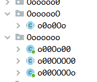
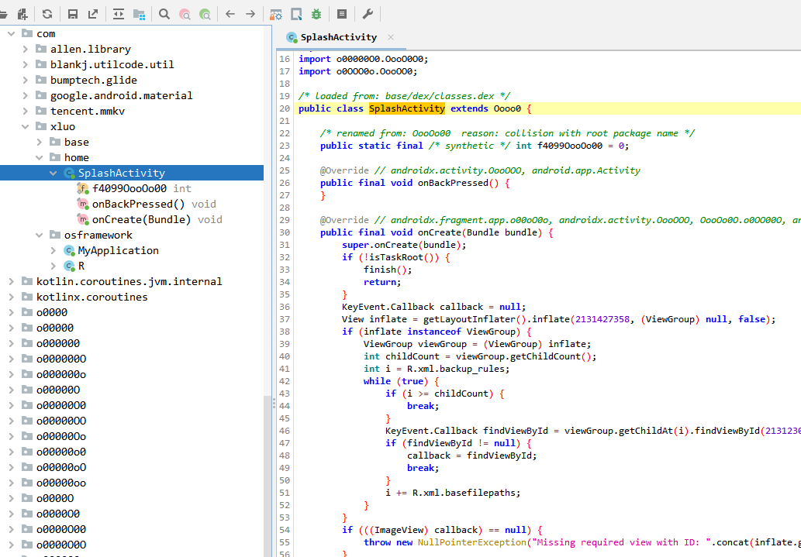
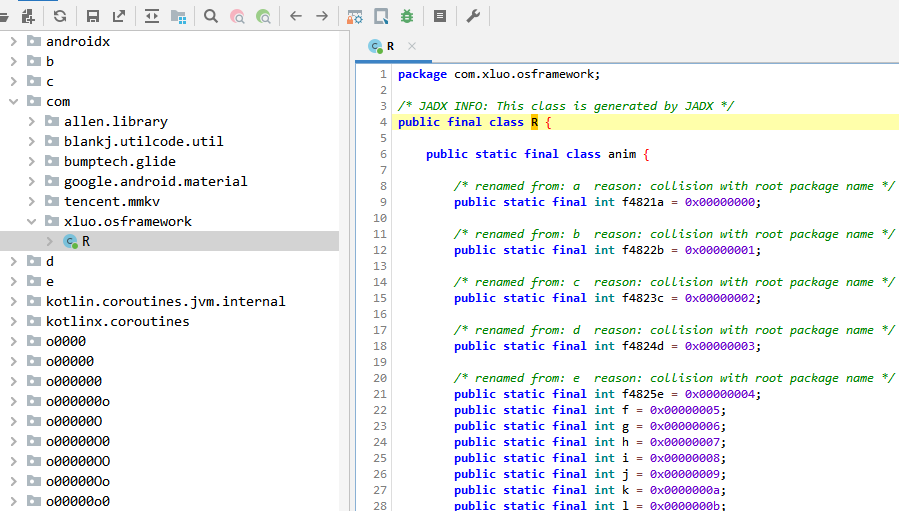
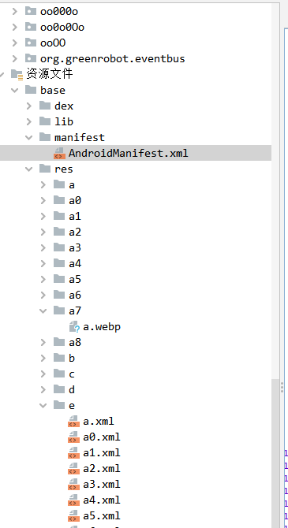

# 海外包框架
---

4层混淆加密功能：
* 第一层：proguard-rules自带混淆；

* 第二层：增加dic.txt超级混淆字典，我称之为甜甜圈字典，因为全是0o圈符号；



* 第三层：XmlClassGuard混淆，对xml文件中嵌套的class进行混淆；

* 第四层：ResChiper混淆

# 使用说明

第一二层混淆，自研源码和第三方sdk在proguard文件中注意添加排除混淆即可。

第三层混淆执行 xmlClassGuardGoogleRelease任务，这是个修改源码的任务，不要在master上执行，可自行开分支执行。

执行后可能部分类会遗漏导致报错，按照报错提示把相应的类名和文件名称改成一致即可，部分package可能也需要修改。

这一步很重要，因为这一步把四大组件也混淆了。可以看看前后对比

执行前：



执行后：



区别很大。

执行命令：
```shell
./gradlew app:xmlClassGuardGoogleRelease
```

第三层混淆能运行之后，第四层是侵入式混淆，会直接构建aab包。

执行命令：
```shell
./gradlew app:resChiperGoogleRelease
```
这一步会清理无用资源，同时混淆res下的所有文件。



资源文件只对文件路径和文件名做字典混淆，


最终得到的appName_versionName.aab即为可发布包
